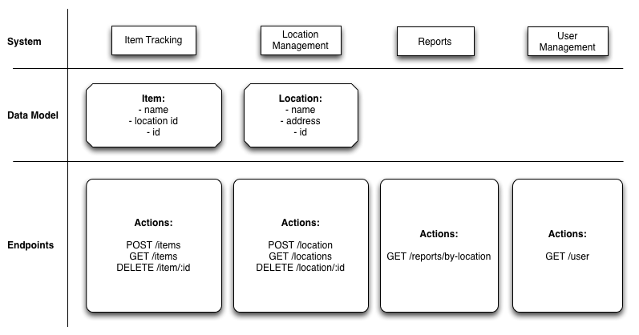

# ScalableWebArchitectures

This Repository stores my projects for the Scalable Web Architectures class at University of Applied Science.

## How to run

This distributed system uses Rack. The port numbers are specified in the config.SERVICE_NAME.ru files, therefore the port number doesn't have to be specified.
The ports are:
* User Management System: 9292
* Reports System: 9393
* Location Management: 9494
* Item Tracking System: 9595

To start services use the following commands:
```sh
	rackup -o 0.0.0.0 config.user_management.ru
	rackup -o 0.0.0.0 config.location_management.ru
	rackup -o 0.0.0.0 config.item_tracking.ru
	rackup -o 0.0.0.0 config.reports.ru
```

## The system

This distributed system consists of four subsystems. These subsystems communicate via HTTP with each other.
The following figure shows the systems and their endpoints:


Source: https://github.com/nesQuick/2015-salzburg-soa-workshop/blob/master/challenges/final/assets/final-challenge-systems-overview.png

